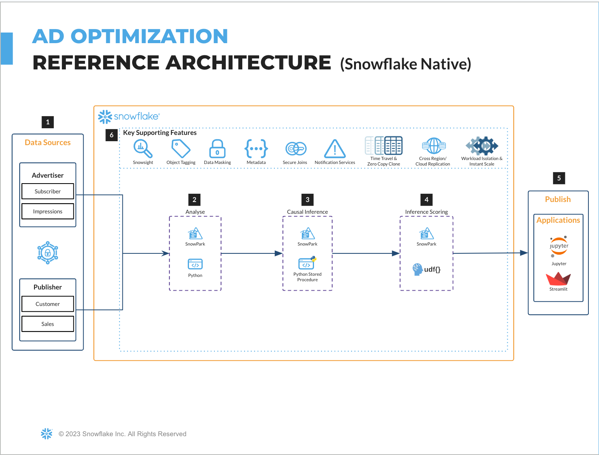
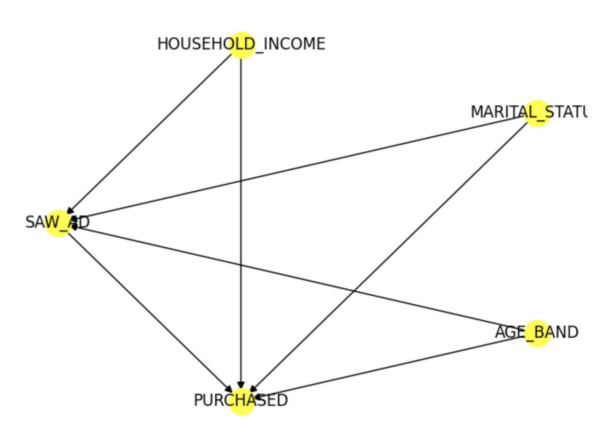

author: sfc-gh-hchung
id: polaris_advertising_sales_lift
summary: Polaris - Media Advertising Campaign Optimization Solution
categories: Getting-Started
environments: web
status: Published 
feedback link: https://github.com/Snowflake-Labs/sfguides/issues
tags: Getting Started, Data Science, Data Engineering, Twitter 


# Polaris - Media Advertising Campaign Optimization Solution
<!-- ------------------------ -->
## Overview
Duration: 1

Industry solution asset for media data cloud.


Blog post: [https://medium.com/snowflake/advertising-campaign-measurement-with-causal-inference-and-snowflake-data-clean-rooms-313121d8d76a](https://medium.com/snowflake/advertising-campaign-measurement-with-causal-inference-and-snowflake-data-clean-rooms-313121d8d76a)

Advertisers use “sales lift,” estimating the increase in sales that results from a specific advertisement, to measure the effectiveness of their advertising. Doing so allows advertisers to make more informed decisions about where to allocate their advertising budget, what types of ads to use, and how to target those ads to maximize their effectiveness. However, it's critical to note that in the absence of “randomized control trials” (RCTs), which are often expensive and infeasible for advertising, not accounting for confounding effects can lead to misleading conclusions. Confounding variables, such as demographic factors like age or income, can influence both advertisement and sales. If these variables are not controlled for, Advertisers may attribute the increase in sales to the advertisement when it is actually due to the confounding variable. To ensure accurate conclusions, advertisers can use “causal inference” to identify and control for confounding variables that might influence both the advertisement and sales. By doing this, they can ensure that their conclusions about the impact of an ad campaign are accurate and not affected by other factors. Additionally, using non-confounding effects can also help to reduce noise in the data and improve the accuracy of the causal effect estimate. The purpose of this use case is to demonstrate the Snowflake platform for causal inference and how advertisers can benefit from it. Overall, by using causal inference analysis and accounting for confounding variables, Advertisers can optimize their advertising efforts, increase sales, and make more data-driven decisions to improve their bottom line using the Snowflake platform.

### Storyline
The brand connects its customer list to impressions on the ad platform/publisher using a Data Cleanroom. This is a secure environment that ensures data privacy and security, and ensures compliance with regulations such as GDPR and CCPA. The brand builds machine learning models to predict the impact of a campaign on its sales. These models are built using attributes that are available to the ad platform/publisher, such as demographic information and browsing behavior. The brand uses the models to score the publisher's visitors, even those for whom the brand does not have first-party data. This data can come from the publisher's own data or from third-party sources such as Experian, Epsilon or Acxiom. The publisher uses data from the brand to improve the targeting and bidding of the campaign. This can involve targeting ads to specific segments of visitors who are most likely to be interested in the brand's products. In addition, they can choose to bid more aggressively for ad space in those segments. The brand realizes value by seeing an increase in sales from the optimized ad campaign. Additionally, the brand can also use the data and insights gathered from the campaign to improve its future campaigns and overall marketing strategy.

### Prerequisites
*[Snowflake account](https://signup.snowflake.com/)* Login to your [Snowflake account](https://signup.snowflake.com/) with the admin credentials that were created with the account in one browser tab (a role with ORGADMIN privileges). Keep this tab open during the workshop. *Click on the Billing on the left side panel *Click on [Terms and Billing](https://app.snowflake.com/terms-and-billing) *Read and accept terms to continue with the workshop *As ACCOUNTADMIN role *Create a [Warehouse](https://docs.snowflake.com/en/sql-reference/sql/create-warehouse), a [Database](https://docs.snowflake.com/en/sql-reference/sql/create-database) and a [Schema](https://docs.snowflake.com/en/sql-reference/sql/create-schema)

### What You’ll Learn 
<!-- -----need content-------- -->

### What You’ll Need 
- [GitHub](https://github.com/) Account 
- [VSCode](https://code.visualstudio.com/download) Installed
- [NodeJS](https://nodejs.org/en/download/) Installed
- [GoLang](https://golang.org/doc/install) Installed

### What You’ll Build 
<!-- -----need content-------- -->

<!-- ------------------------ -->
## Set up - Snowpark Python
Duration: 2
### Overview
<!-- --------Susan writing here--------- -->

- The [polaris_advertising_sales_lift.ipynb](https://github.com/Snowflake-Labs/advertising-measurement-causal-analysis-Notebook/notebook/ML_Experimentation.ipynb) notebook covers foundational feature/functions of a basic data science workflow using Snowpark for Python.
- You will walk through the following steps as a Data Scientist tasked with building and deploying a model on Snowflake to use causal inference to calculate sales lift to measure the effectiveness of an advertising campaign.
  - **Snowpark Fundamentals**
    - Connect to Snowflake
    - Explore the API 
    - Load the data into a DataFrame
  - **Data Exploration & Feature Engineering**
    - Aggregate functions
    - Imputation, encoding, and train/test split
  - **Model Training & Deployment**
    - Training in a stored procedure
    - Elastic scalability
    - Deploying a user-defined function for model inference

### Step 1 - Cloning the GitHub Repository

[Clone](https://docs.github.com/en/repositories/creating-and-managing-repositories/cloning-a-repository) the [GitHub repository](https://github.com/Snowflake-Labs/advertising-measurement-causal-analysis-Notebook). This repository contains all the code you will need to successfully complete this QuickStart Guide.

```
$ git clone https://github.com/Snowflake-Labs/sfguide-tasty-bytes-snowpark-101-for-data-science.git
```
### Step 2 - Updating the Connection File
- Update [**sflk_connection.json**](https://github.com/Snowflake-Labs/Users/hchung/Documents/GitHub/advertising-measurement-causal-analysis-Notebook/snowflake_connection_template.json) file with your Snowflake account credentials. The Python notebook will use this file to access your credentials and connect to Snowflake.<br>


>aside positive    
> For the `account` parameter, use your [account identifier](https://docs.snowflake.com/en/user-guide/admin-account-identifier). Note that the account identifier does not include the snowflakecomputing.com suffix.

### Step 3 - Creating the Python Environment
>aside positive
>These instructions use [Anaconda](https://www.anaconda.com/) for creating the Python environment. *However, you may use any other Python environment with Python 3.8, for example, [virtualenv](https://virtualenv.pypa.io/en/latest/)*.

>aside negative
>**Apple M1**: There is a known issue with running Snowpark Python on Apple M1 chips due to memory handling in pyOpenSSL. Please refer to the [**Snowpark documentation**](https://docs.snowflake.com/en/developer-guide/snowpark/python/setup.html) to solve this issue.<br>

 **From the terminal, navigate to the cloned GitHub repository and build the environment. Execute the following to build the Python environment and launch Jupyter Notebook:**<br>
    i. In the terminal, execute
```
conda env create -n snowpark_causal_inference --file conda_snowpark_environment.yml
 ```
ii. Activate the environment
 ```  
conda activate snowpark_causal_inference
 ```
iii. Launch Jupyter Notebook

```
jupyter notebook
```

### Step 4- Running the Jupyter Notebook
- Open and run through each cells of [polaris_advertising_sales_lift.ipynb](https://github.com/Snowflake-Labs/advertising-measurement-causal-analysis-Notebook/notebook/ML_Experimentation.ipynb) in Jupyter Notebook to train a model, register it as a Stored Procedure and deploy it using Snowpark Python UDFs.


- The first time you run the notebook, change the value of setup to True. Make sure to set it back to False afterwards to avoid repating setup when running the notebook again
- With setup=True the notebook will create the required datawarehouse and database, then upload the data into a table. This can take a bit of time, especially uploading the data. 
- With setup=False the notebook will attempt to set the session to use the previously created warehouse and schema. This will error if they were not created as specified above. 


### Troubleshooting
- PyArrow related issues: Uninstall `pyarrow` before installing Snowpark.

  
<!-- ------------------------ -->
## Need a title for this section
Duration: 2

### Objective 
- Causal inference is a machine learning technique to identify and control for confounding variables that might influence both the advertisement and sales. In this solution a brand connects its customer list including sales information to impressions on the ad platform/publisher using a Data Cleanroom. The brand builds machine learning models to measure the impact of a campaign on its sales. These models are built using attributes that are available to the advertiser, such as demographic information and browsing behavior. The brand also uses the models to score consumers based on their likelihood to be influenced by the campaign. 

### Solution Architecture


### Use Case Flow
1. Ad impressions for subscribers and Sales data for customers is joined in a Snowflake Data Clean Room (optional).
2. Identify and control for confounding variables without requiring a RCT (randomized controlled trial).
3. Causallib package to perform causal inference, control for confounding variables (marital status, age) and to quantify sales lift 
4. A trained model to predict purchasing is saved as a model object within snowflake and called via a UDF in Snowpark to calculate a score for new consumers. 
5. Data scientist can interact with Jupyter notebook and view application via Streamlit
6. Leverage key supporting functions including role based access control, masking and replication in addition to workload isolation and instant scaling.

### Related Content
Solution page: [CAUSAL INFERENCE FOR SALES LIFT] (https://www.snowflake.com/en/resources/technical/ad-campaign-effectiveness-sales-lift/) 
Youtube: [Optimize Your Ad Campaigns In Snowpark] (https://www.youtube.com/watch?v=Lva9klc3zu0)


### Causal Inference - Confounders, Treatment and Outcome Variables


<!-- ------------------------ -->


<!-- ------------------------ -->
## Conclusion
Duration: 1
<!-- -----need content-------- -->

### What we've covered
- 
<!-- -----need content-------- -->